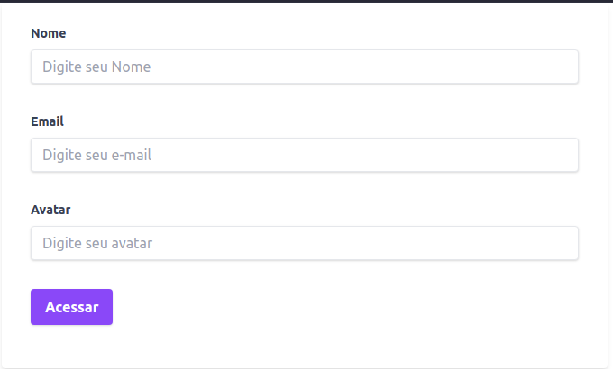
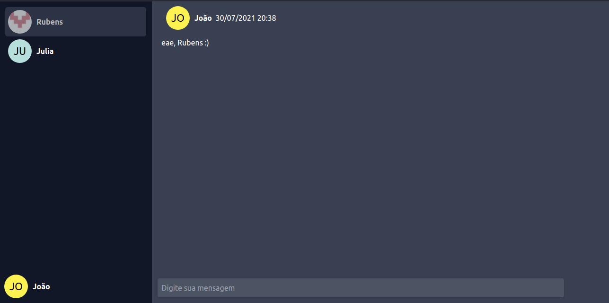
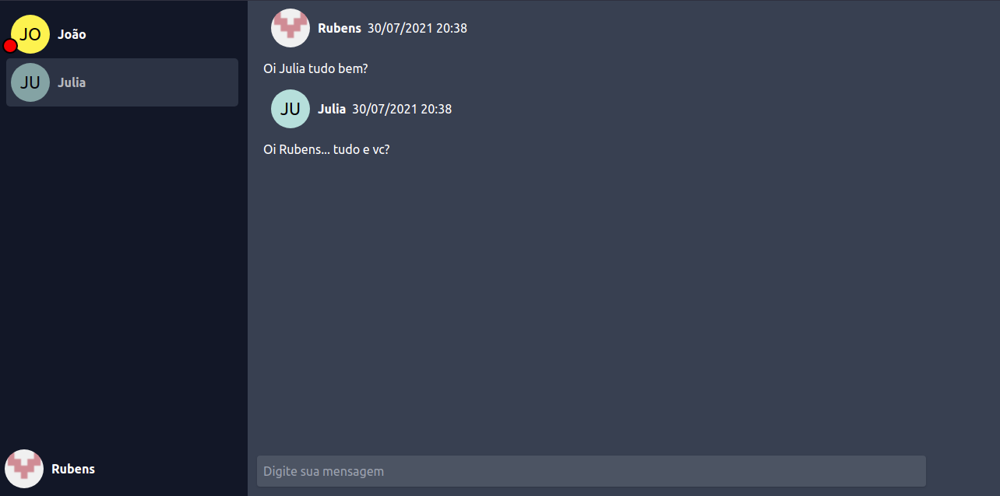

<h1 align="center">🚀 RocketSocket</h1>

## 💻 Projeto
RocketSocket é uma aplicação feita para estudos do protocolo WebSocket. O projeto consiste em um chat onde usuários pode entrar ao se cadastrar e se comunicar com outros usuário em salas privadas!

<div align="center">
    
</div>
</br>
<div align="center">
    
</div>
</br>
<div align="center">
    
</div>

 ## 🚀 Como usar

1. Clone o projeto
 ```
git clone https://github.com/rubensjunqueira/rocketsocket.git
 ```

2. Entre na pasta do projeto
 ```
cd rocketsocket
 ```

 3. Instale as dependências
 ```
yarn
 ```

 4. Crie o banco de dados com docker
 ```
docker run --name mongodb -p 27017:27017 -d -t mongo
 ```

 5. Execute o projeto
 ```
 yarn dev
 ```

 Para cada usuário que quiser adicionar a lista acesse: http://localhost:3000


## 🔥 Tecnologias
 - [NodeJs](https://nodejs.org/en/)
 - [Typescript](https://www.typescriptlang.org/)
 - [Socket.io](https://socket.io/)
 - [Express](https://expressjs.com/pt-br/)
 - [MongoDB](https://www.mongodb.com/pt-br)
 - [Mongoose](https://mongoosejs.com/)
 - [ESlint](https://eslint.org/)
 - [Docker](https://www.docker.com/)
 - [Tsyringe](https://github.com/microsoft/tsyringe)